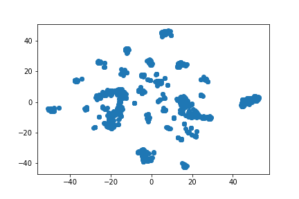

# Is There a Gold Rush in Space? -[Project 4](https://docs.google.com/presentation/d/1WrAVQI9V08n4OEUu_3g1Q8SCExFkWFP5iZyAqFr-Fxc/edit#slide=id.g12f58cb7c27_0_123)

  

### Table of Contents  
- [Purpose](#purpose)  
- [Asteroid Info](#asteroid-info)  
- [Process](#process-and-etl)
- [Correlation](#correlation)
- [Machine Learning](#machine-learning)
- [Website](#website--heroku)
   
<a name="purpose"/>
<a name="asteroid-info"/>
<a name="process-and-etl"/>
<a name="correlation"/>
<a name="machine-learning"/>
<a name="website--heroku"/>

## Purpose
The purpose of our project was to utilize machine learning to optimize the profit of future asteroid mining. For this, we trained and tested various machine learning models until we optimized and tuned our model to the highest accuracy score. We did this by first creating a hypothesis of which features we thought may impact our model the most and then running many different models to optimize and tune the model we decided on using. In the end we were able to tell, using a handful of features, if an asteroid was profitable to an accuracy of over 80%. The most impactful optimization we did was removing features that were not easy to obtain without spending more resources, like time and money, and those were asteroid class and spectral class. To obtain these features an asteroid must be observed and classified by scientists running expensive equipment and can take many months. In our research we also found that less than 1% of asteroids have these defining features, so it was very important for us to only utilize features that could be easily obtained.

- - -

## Asteroid Info
Asteroids, as we all know, come in a variety of shapes and sizes. They are also scattered all over the universe! Most notable asteroids are placed into a class-based on where they are in accordance to the earth, and a spectral type-based on the spectral imaging for some asteroids. Spectral type is essentially the asteroids 'geology' or what scientists believe their makeup is. These identifying features directly influence the estimated price for an asteroid. The makeup can range anywhere from precious earth metals such as iron, nickel, iridium, palladium, platinum, gold, and magnesium to even carrying water!

  

  

The above image is a visual representation of some other data points we can find for most asteroids. This would be the aphelion and perihelion distance, and these two features are what directly influence an asteroids class. These distance measurements allow us to find the 'perfect' time to mine asteroids as well as figuring out if its even worth the time, effort and money to even mine. Basically, I am saying YES-- there technically is an 'asteroid season'.

- - -

## Process and ETL
After having researched asteroids for many many hours we were able to decide how we wanted to handle our data storage and retreival process. We didn't want our website to be weighed down by needing to have csv files to train and test off of so we decided to make multiple api calls which would keep our physical local repositories light and without the need of a database we could use our physical machines for the 'heavy-lifting' machine learning algorithms. We did end up creating a csv for our heroku deployment, but would have prefered to only utilize the GET and POST features of our flask app to temporarily hold our asteroid data before being loaded directly into our algorithm. Below is a flow chart of the process we used.

  

- - -

## Correlation
Before we ran multiple machine learning algorithms we used a correlation heatmap to zero-in on exactly which features we wanted to use. It was simple using seaborn to create a heatmap to find the points of correlation between all of our different features. The features we ended up using were (in order): aphelion distance, perihelion, semi-major axis, eccentricity, delta-velocity, period (how long it takes for 1 revolution around the sun), minimum orbit intersection distance, and diameter. Of all of these features, diameter seemed to be the feature that correlated the most to an asteroids profitability. For a visual reprentation of all of these features visit [this](https://public.tableau.com/app/profile/christopher.uranga/viz/AsteroidVisualizations/Diameter) tableau public page to see. Below is the heatmap we created to visually see all of this.

  

- - -
## Machine Learning
For our machine learning models we ran various tests to finalize a decision. We ran random forest classifier models, (selected) logistic regression, logistic regression, k-means clustering, and a neural network. We observed that like many things in nature, asteroids have a clustering nature and can be grouped together even when things like class and spectral type are left out. Preprocessing of the data was used for every model to make sure each was running as accurate as possible. We determined that random forest classifier was able to do a similar job that the neural network did without being as costly in terms of hardware usage. Both the neural network and random forest ended up with a score of over 80%. In the future we would like to further optimize the neural network and be able to put it into production since we believe its accuracy will not decline as fast as the random forest's accuracy does. Below are some images of the clusters before and after removing identifying features, as well as accuracy and loss charts for the neural network.

           
Spectral Type Included

           
 

           
Class Included

           
 

           
No Identifying Features

           
 

The Resoning for the class to have less clusters than the spectral type is because there are far less classes than there are spectral types.

 

- - -

## Website & Heroku
Below are images to the fully functioning website deployed via Flask app, and some images of the machine learning outputs and our database deployed on heroku.

  

  

  

